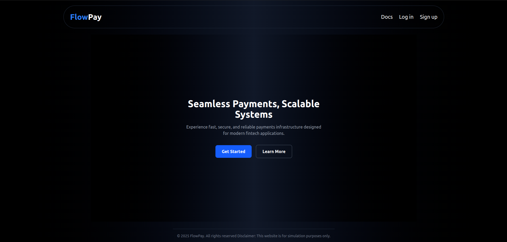
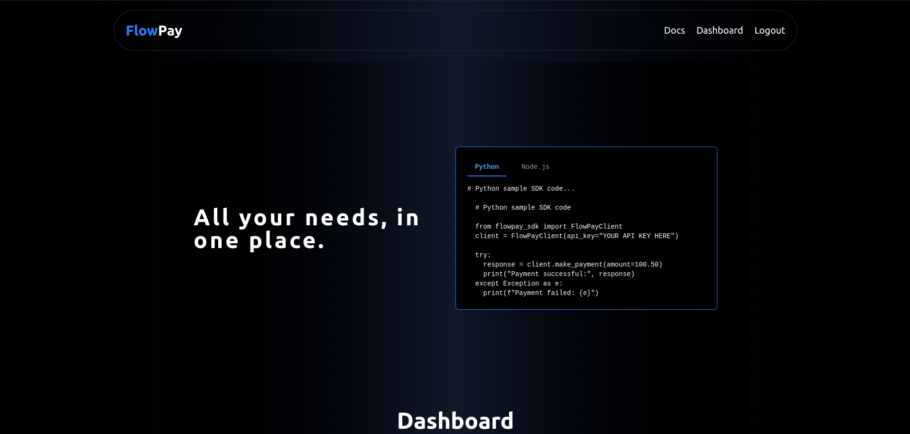
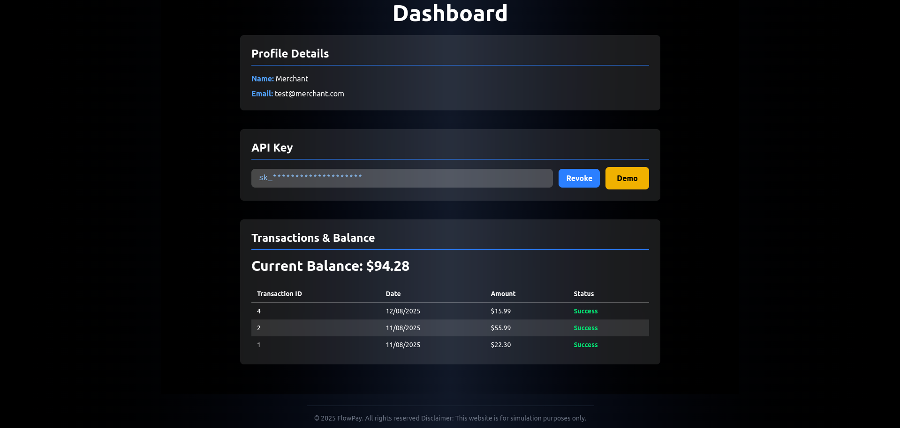

# FlowPay — Functional Payments Platform in Haskell (https://flowpayratna.netlify.app/)

FlowPay is a lightweight, scalable, and secure payment backend built entirely in Haskell, with a modern TypeScript + React frontend, JWT-based authentication, PostgreSQL persistence, and a microservice-friendly architecture.

This project demonstrates how functional programming principles can power a real-world payments system with type safety, high reliability, and maintainability. It is designed to handle 1,000+ simulated transactions/day.




## Features

- Secure Authentication
  - Merchant registration & login via bcrypt-hashed passwords
  - JWT-based authentication with 24-hour expiry and XSRF protection
- Payment Processing API
  - API key–based access for merchant-to-platform payments
  - Simulated transaction handling with balance updates
- Merchant Dashboard
  - Real-time balance checks
  - Transaction history listing
  - API key generation & revocation
- Functional Backend
  - Servant-based API definitions
  - PostgreSQL integration with `postgresql-simple`
  - Clear separation of public and protected routes
- Modern Frontend
  - React + TypeScript UI
  - TailwindCSS for styling
  - Fully responsive merchant dashboard
- Safety-First Design
  - No nullable surprises — enforced at the type level
  - Explicit error handling with Servant's typed errors


## Project Structure
```
Flowpay/
├── backend/
│ ├── app/ 
| | ├── Main.hs Server entry point
│ ├── src/
│ │ ├── Api.hs # Full Servant API type + server wiring
│ │ ├── App.hs # App monad, environment, DB connection
│ │ ├── Handlers/ # Route-specific business logic
│ │ └── Models/ # Data types + JSON/DB instances
│ ├── package.yaml
│ └── Dockerfile
│
├── frontend/
│ ├── src/
│ │ ├── components/ # React UI components
│ │ ├── pages/ # Dashboard, Docs, Landing
│ │ ├── Context/ # Auth context & provider
| | ├── main.tsx
│ │ └── App.tsx
│ ├── tailwind.config.js
│ └── package.json
│
└── README.md
```


## Quick Start

### Backend (Haskell with Stack)

**Prerequisites:**
- [Stack](https://docs.haskellstack.org/en/stable/README/)
- PostgreSQL running locally or via Docker

# Clone repo
git clone https://github.com/RatnakirtiKamble/FlowPay.git
cd flowpay/backend

# Install dependencies
stack setup
stack build

# Run backend
stack run

### Frontend (Vite with React)
cd flowpay/frontend

# Install dependencies
npm install

# Start development server
npm run dev


# API Overview
## Public Endpoints

    POST /register — Register a new merchant

    POST /login — Merchant login (returns JWT & XSRF token)

    POST /payments — Process payment via API key

## Protected Endpoints (JWT Required)

    GET /merchant/balance — Get merchant balance

    POST /merchant/apikey/generate — Generate API key

    POST /merchant/apikey/revoke — Revoke API key

    GET /merchant/payments — List past payments

    GET /dashboard — Merchant profile overview

    POST /logout — Logout current session

## SDK docs are available in frontend/pages/Docs.tsx.

# Tech Stack

## Backend

    Haskell (Stack)

    Servant

    postgresql-simple

    servant-auth

    BCrypt

    Aeson

## Frontend

    React (TypeScript)

    TailwindCSS

    Axios

    React Router

## Infrastructure

    PostgreSQL

    Docker

    Railway.app (deployment target)

# Security Highlights

    All passwords bcrypt-hashed

    JWT tokens signed with HMAC

    XSRF protection for frontend API calls

    Role-based route protection via Servant’s Auth combinator

    CORS policy configured for frontend domain

# Why Haskell for Payments?

## Payments demand:

    Predictable behavior

    Strong guarantees on data correctness

    Easy refactoring without regressions

## Haskell’s type system ensures that:

    All API contracts are compile-time verified

    Nullable/optional values are handled explicitly

    Business logic is isolated and testable

# Future Improvements

    Role-based multi-user access

    Real payment gateway integration

    GraphQL API option

    Webhooks for payment events

    Merchant analytics dashboard

